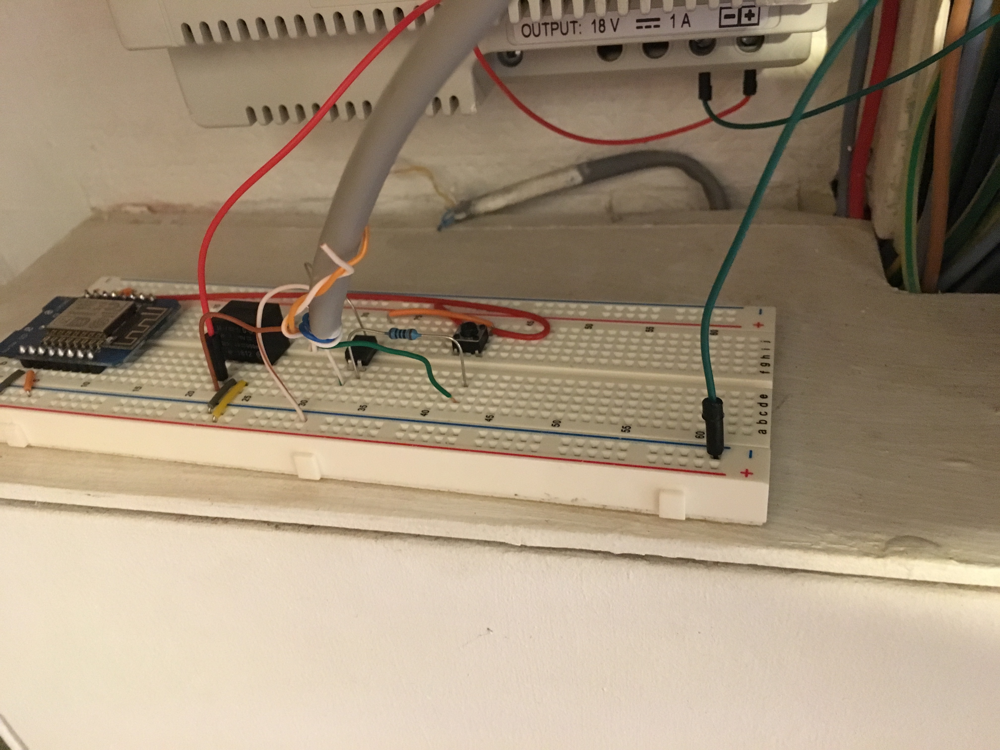

# Simple notification system using ESP8266 (Wemos)

Purpose here is to trigger a webhook when my legacy doorbell is ringing

ESP is powered via the doorbell power, so I'm using a regulator
Doorbell is notifying ESP via an optocoupler

Here it's calling my "bose-music-control" project that send notification over Bose SoundTouch devices

